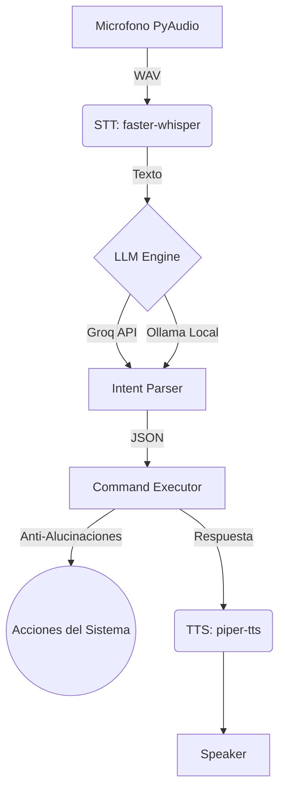

# 🎙️ Carmen (Linux Voice Assistant)

> Tu asistente de voz personal y privado para entornos Linux.
> No GUI · Zero Telemetry · Hyprland/Wayland Native


Un asistente de voz ultra rápido y extensible que corre **directamente en tu terminal**, optimizado para desarrolladores y usuarios de Linux (especialmente CachyOS / Hyprland).

## ✨ Funcionalidades Destacadas

- 🚀 **Velocidad Extrema (Modo Turbo):** Arquitectura híbrida. Utiliza la API gratuita de **Groq** para procesar lenguaje natural en menos de un segundo, y cae automáticamente a **Ollama local** si no hay internet.
- 🗣️ **Voz Natural Multi-Hablante:** Integración con *Piper TTS* soportando modelos de 22kHz con perfiles masculinos y femeninos.
- 🛡️ **Cortafuegos Anti-Alucinaciones:** Motor de ejecución reflectivo (`inspect.signature`) que filtra automáticamente comandos y parámetros inventados por la IA, garantizando que el asistente nunca falle (crash) por alucinaciones.
- 🌐 **Lectura Web Inteligente:** Al hacer una búsqueda web, el asistente raspa los resultados en texto plano y *te lee un resumen en voz alta*, además de abrirte el navegador.
- 🎵 **Control Integrado (Linux):** Controles multimedia globales (`playerctl`) y administración de ventanas activa (`hyprctl`).
- 🎮 **Integración con Aplicaciones:** Cierre seguro de procesos críticos (como Steam), apertura de proyectos en VS Code y soporte para Discord.

## 📐 Arquitectura



## ⚙️ Quick Start

### 1. Dependencias del sistema (Arch/CachyOS)
```bash
sudo pacman -S python python-pip portaudio ffmpeg espeak-ng playerctl brightnessctl
yay -S ollama piper-tts
```

### 2. Configurar entorno Python
```bash
python3 -m venv limits-env
source limits-env/bin/activate
pip install -r requirements.txt
```

### 3. Descargar modelos (LLM y Voz)
```bash
# Iniciar Ollama y descargar modelo de respaldo
sudo systemctl enable --now ollama
ollama pull qwen2.5-coder:7b

# Descargar voz femenina de Piper (sharvard)
mkdir -p ~/.local/share/piper
cd ~/.local/share/piper
wget https://huggingface.co/rhasspy/piper-voices/resolve/main/es/es_ES/sharvard/medium/es_ES-sharvard-medium.onnx
wget https://huggingface.co/rhasspy/piper-voices/resolve/main/es/es_ES/sharvard/medium/es_ES-sharvard-medium.onnx.json
```

### 4. Configurar .env
Crea un archivo `.env` en la raíz (basado en config.py) con tu llave de Groq (para Modo Turbo), tu palabra de activación (`WAKE_WORD=Carmen`), y selecciona tu hablante favorito (`VOICE_SPEAKER=1`).

### 5. Ejecutar
```bash
# Modo normal (espera tu wake word)
./limits-env/bin/python main.py

# Modo texto (para probar sin micrófono)
./limits-env/bin/python main.py --text
```

## 🛠️ Systemd Service (Autostart)
Para que Carmen inicie en segundo plano automáticamente con tu sesión de Linux:
```bash
./setup-service.sh
```

## 🧩 Extending (Crea tus comandos)

Añadir un comando a tu asistente es trivial:

1. Crea la función en `commands/custom.py`.
2. Regístrala en el diccionario de `modules/executor.py`.
3. Dale ejemplos de cómo se dice en `prompts/system_prompt.txt`.
*El Cortafuegos del ejecutor se encargará automáticamente de mapear y limpiar las variables dictadas por la IA.*
