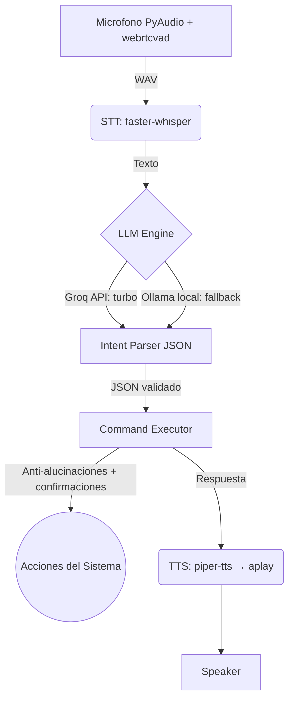

# 🎙️ Limits (Linux Voice Assistant)

> Tu asistente de voz personal y privado para entornos Linux.
> No GUI · Zero Telemetry · Hyprland/Wayland Native


Un asistente de voz ultra rápido y extensible que corre **directamente en tu terminal**, optimizado para desarrolladores y usuarios de Linux (especialmente CachyOS / Hyprland).

> [!WARNING]
> **Prealpha 1.0 — Unstable.** El proyecto es funcional para uso personal, pero el
> formato de intents, la configuración y los módulos pueden cambiar sin previo aviso.
> No lo consideres estable hasta que aparezca un release `beta`.

## ✨ Funcionalidades Destacadas

- 🚀 **Velocidad Extrema (Modo Turbo):** Arquitectura híbrida. Utiliza la API gratuita de **Groq** para procesar lenguaje natural en menos de un segundo, y cae automáticamente a **Ollama local** si no hay internet o falla Groq.
- 🗣️ **Voz Natural Local:** Integración con *Piper TTS* (22kHz) con fallback a `espeak-ng`.
- 🛡️ **Cortafuegos Anti-Alucinaciones:** Motor de ejecución reflectivo (`inspect.signature`) que filtra automáticamente comandos y parámetros inventados por la IA, además de validación estricta de tipos del JSON recibido.
- 🔐 **Confirmaciones Verbalmente Explícitas:** Acciones destructivas (`shutdown`, `reboot`) requieren un intent dedicado de confirmación (`confirm` / `cancel`); nunca se infiere de frases ambiguas.
- 🌐 **Lectura Web Inteligente:** Las búsquedas web raspan los resultados en texto plano y *te leen un resumen en voz alta*, además de abrir el navegador.
- 🎵 **Multimedia Avanzado:** Reproducción directa en Spotify (URI nativa), YouTube vía `mpv` + `yt-dlp` (con modo solo-audio), letras vía lyrics.ovh y detección de la canción actual con `playerctl`.
- 🪟 **Control de Ventanas (Hyprland):** Foco por clase de ventana real (`hyprctl clients -j`) con apertura automática si no existe, kill/fullscreen y controles multimedia globales.

## 📐 Arquitectura



**Flujo de un turno:**

1. El micrófono graba con VAD (corta tras ~900 ms de silencio, máx. 10 s).
2. Whisper transcribe localmente y se filtra por *wake word* (configurable).
3. El LLM (Groq → Ollama) devuelve **exclusivamente** un JSON `{intent, action, params, response, confidence}` guiado por `prompts/system_prompt.txt` (few-shot).
4. El executor valida tipos, filtra parámetros inexistentes en las firmas Python, exige confirmación en acciones peligrosas y ejecuta via `subprocess` (listas de args, jamás `shell=True`).
5. Piper sintetiza la respuesta y la reproduce por `aplay`.

## ⚙️ Quick Start

### 1. Dependencias del sistema (Arch/CachyOS)
```bash
sudo pacman -S python python-pip portaudio ffmpeg espeak-ng playerctl brightnessctl mpv yt-dlp
yay -S ollama piper-tts
```

### 2. Configurar entorno Python
```bash
python3 -m venv limits-env
source limits-env/bin/activate
pip install -r requirements.txt
```

### 3. Descargar modelos (LLM y Voz)
```bash
# Iniciar Ollama y descargar modelo de respaldo
sudo systemctl enable --now ollama
ollama pull qwen2.5-coder:7b

# Descargar voz por defecto (davefx, masculina)
mkdir -p ~/.local/share/piper
cd ~/.local/share/piper
wget https://huggingface.co/rhasspy/piper-voices/resolve/main/es/es_ES/davefx/medium/es_ES-davefx-medium.onnx
wget https://huggingface.co/rhasspy/piper-voices/resolve/main/es/es_ES/davefx/medium/es_ES-davefx-medium.onnx.json

# Alternativa multi-hablante femenina (configura PIPER_VOICE_MODEL y VOICE_SPEAKER en .env)
# wget https://huggingface.co/rhasspy/piper-voices/resolve/main/es/es_ES/sharvard/medium/es_ES-sharvard-medium.onnx
# wget https://huggingface.co/rhasspy/piper-voices/resolve/main/es/es_ES/sharvard/medium/es_ES-sharvard-medium.onnx.json
```

### 4. Configurar .env
Copia la plantilla y rellena tus valores:
```bash
cp .env.example .env
```
Como mínimo define `GROQ_API_KEY` (gratis en [console.groq.com](https://console.groq.com)) para el Modo Turbo. Sin ella, Limits funciona igual pero solo con Ollama local. Consulta la [tabla de configuración](#-configuracin-env) para todas las variables.

### 5. Ejecutar
```bash
# Modo normal (espera tu wake word)
./limits-env/bin/python main.py

# Modo texto (para probar sin micrófono)
./limits-env/bin/python main.py --text

# Ejecutar un solo turno y salir (voz o texto)
./limits-env/bin/python main.py --once
```

> [!TIP]
> La guía completa de los tres modos de operación (voz, texto y servicio systemd) está en [INICIO.md](INICIO.md).

## 🛠️ Systemd Service (Autostart)
Para que Limits inicie en segundo plano automáticamente con tu sesión:
```bash
chmod +x setup-service.sh
./setup-service.sh
systemctl --user status limits.service
```

## ⚙️ Configuración (.env)

| Variable | Default | Descripción |
|---|---|---|
| `OLLAMA_URL` | `http://localhost:11434` | Endpoint de Ollama |
| `OLLAMA_MODEL` | `qwen2.5-coder:7b` | Modelo local de respaldo |
| `GROQ_API_KEY` | *(vacío)* | Llave para Modo Turbo (prioritario si existe) |
| `WHISPER_MODEL` | `small` | `tiny` / `base` / `small` / `medium` |
| `LANGUAGE` | `es` | Idioma de transcripción |
| `STT_DEVICE` | `cpu` | `cpu` o `cuda` |
| `PIPER_VOICE_MODEL` | `~/.local/share/piper/es_ES-davefx-medium.onnx` | Ruta al modelo de voz |
| `VOICE_SPEED` | `1.0` | Velocidad de la voz |
| `VOICE_SPEAKER` | *(vacío)* | ID de hablante para voces multi-speaker |
| `WAKE_WORD` | `Limits` | Palabra(s) de activación separadas por coma; vacío = siempre activo |

## 🗣️ Ejemplos de Comandos de Voz

| Di algo... | Limits hace... |
|---|---|
| *"abre Spotify"* / *"trae Discord al frente"* | Abre la app o enfoca su ventana |
| *"sube el volumen al 70"* / *"baja el volumen 10"* | Volumen absoluto/relativo via `wpctl` |
| *"pon a Bad Bunny en Spotify"* | Búsqueda directa en la app |
| *"pon en youtube lo-fi solo audio"* | Reproduce con `mpv` sin video |
| *"qué canción suena"* / *"dime la letra"* | Metadatos + letras leídas en voz alta |
| *"busca cómo instalar docker"* | Abre Google y lee un resumen |
| *"¿cuánta RAM estoy usando?"* | Info del sistema via `psutil` |
| *"cierra spotify"* / *"apaga el sistema"* | Cierre seguro / confirmación verbal |

## 🧩 Extending (Crea tus comandos)

Añadir un comando a tu asistente es trivial:

1. Crea la función en `commands/custom.py`.
2. Regístrala en el diccionario `action_map` de `modules/executor.py`.
3. Añade ejemplos few-shot en `prompts/system_prompt.txt`.

*El Cortafuegos del executor se encarga automáticamente de mapear y limpiar las variables dictadas por la IA.*

Guía técnica detallada (convenciones, seguridad, estructura interna) en [AGENTS.md](AGENTS.md).

## 🔒 Seguridad

- Comandos del sistema siempre con **listas de argumentos**, nunca `shell=True` con strings del LLM.
- Allowlist estricta para comandos de terminal (`git status`, `docker ps`, ...) con límite de palabra; `curl`, `cat` y similares están bloqueados a propósito.
- Acciones destructivas (`shutdown`, `reboot`, o cualquier comando marcado con `requires_confirmation`) quedan **en espera**: solo los intents `confirm`/`cancel` las resuelven.
- Los logs por defecto **no guardan** lo dictado (solo metadatos del turno a nivel INFO).

## 🚦 Estado del Proyecto

| Componente | Estado |
|---|---|
| STT (faster-whisper + VAD) | ✅ Funcional |
| LLM dual Groq/Ollama | ✅ Funcional |
| TTS (piper + fallback espeak) | ✅ Funcional |
| Apps / Sistema / Ventanas | ✅ Funcional |
| Multimedia (Spotify/YouTube/letras) | ✅ Funcional |
| Suite de tests automatizados | 🚧 En construcción (voz dual) |
| Listener en hilo de fondo (`modules/listener.py`) | 🚧 Experimental, sin usar |
| Wake word dedicada (openWakeWord/Porcupine) | 📋 Roadmap |
| Voz natural ElevenLabs para respuestas largas (Piper queda para lo operativo) | ✅ Implementado — [`docs/plan-elevenlabs-tts.md`](docs/plan-elevenlabs-tts.md) |
| Control remoto por voz desde Android + casting a TV | 🚧 Servidor listo + app compilada — [`docs/plan-control-remoto-android.md`](docs/plan-control-remoto-android.md) |
| Cerebro conversacional Gemini Web (charla + investigación) | ⏸ En pausa — [`docs/integracion-gemini.md`](docs/integracion-gemini.md) |

## 📄 Licencia

MIT — ver [LICENSE](LICENSE).
